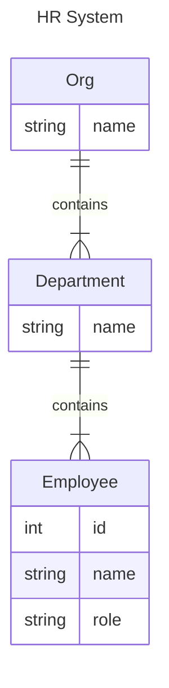

# oncecache: on-demand in-memory object cache

[](https://pkg.go.dev/github.com/neilotoole/oncecache)
[](https://goreportcard.com/report/neilotoole/oncecache)
[](https://github.com/neilotoole/oncecache/blob/master/LICENSE)


`oncecache` is a strongly-typed, concurrency-safe, context-aware,
dependency-free, in-memory, on-demand Golang object cache, focused on write-once,
read-often ergonomics.

The package also provides an event mechanism useful for logging, metrics, or
propagating cache entries between overlapping composite caches.

`oncecache` is targeted at write-once, read-often situations, where a value
corresponding to a key is expensive to compute or fetch, the value is likely to be read
multiple times, and is not expected to change. The cache is not intended for general purpose
caching where values are frequently updated.


## Install

Add to your `go.mod` via `go get`:

```shell
go get github.com/neilotoole/oncecache
```

## Usage

The basic theory of operation is that a [`oncecache.Cache`](https://pkg.go.dev/github.com/neilotoole/oncecache#Cache) is created with a
function that returns the value corresponding to a key. When a key is requested
from the cache, the cache checks if the value is already present. If not, the
cache calls the provided function to compute the value, stores the value, and
returns it. Subsequent requests for the same key return the cached value.

Here's a trivial example that caches computed fibonacci numbers:

```go
func ExampleFibonacci() {
	// Ignore error handling for brevity.
	ctx := context.Background()
	c := oncecache.New[int, int](calcFibonacci)

	key := 6
	val, _ := c.Get(ctx, key) // Cache MISS - calcFibonacci(6) is invoked
	fmt.Println(key, val)
	val, _ = c.Get(ctx, key) // Cache HIT
	fmt.Println(key, val)

	key = 9
	val, _ = c.Get(ctx, key) // Cache MISS - calcFibonacci(9) is invoked
	fmt.Println(key, val)

	// Output:
	// 6 8
	// 6 8
	// 9 34
}

func calcFibonacci(ctx context.Context, n int) (val int, err error) {
	a, b, temp := 0, 1, 0 //nolint:wastedassign
	for i := 0; i < n && ctx.Err() == nil; i++ {
		temp = a
		a = b
		b = temp + a
	}

	if ctx.Err() != nil {
		return 0, ctx.Err()
	}

	return a, nil
}
```

`oncecache.Cache` provides typical operations to interact with the cache, such as
[`Delete`](https://pkg.go.dev/github.com/neilotoole/oncecache#Cache.Delete),
[`Has`](https://pkg.go.dev/github.com/neilotoole/oncecache#Cache.Has),
[`Keys`](https://pkg.go.dev/github.com/neilotoole/oncecache#Cache.Keys), etc.

```go
func ExampleCache_Keys() {
	// Ignore error handling for brevity.
	ctx := context.Background()
	c := oncecache.New[int, int](calcFibonacci)

	for key := 4; key < 7; key++ {
		val, _ := c.Get(ctx, key) // Prime the cache for keys 4, 5, 6
		fmt.Println(key, val)
	}

	keys := c.Keys() // Keys returns indeterminate order
	slices.Sort(keys)
	fmt.Println("Keys in cache:", keys)
	fmt.Println("Num entries:", c.Len())
	fmt.Println("Has key 2?", c.Has(2))

	c.Delete(ctx, 5)
	keys = c.Keys()
	slices.Sort(keys)
	fmt.Println("Keys in cache after Delete(5):", keys)

	// MaybeSet sets the value if the key is not already in the cache.
	didSet := c.MaybeSet(ctx, 4, 3, nil) // No-op: 4 already in cache
	fmt.Println("Did set 4?", didSet)
	didSet = c.MaybeSet(ctx, 7, 13, nil) // Cache write: 7 not in cache
	fmt.Println("Did set 7?", didSet)

	c.Clear(ctx) // Clear empties c, firing any OnEvict callbacks.
	fmt.Println("Keys after cache clear:", c.Keys())

	// Close empties the cache without firing OnEvict. Callbacks are
	// retained and the cache remains fully usable for later Get /
	// MaybeSet / Delete calls.
	_ = c.Close()

	// Output:
	// 4 3
	// 5 5
	// 6 8
	// Keys in cache: [4 5 6]
	// Num entries: 3
	// Has key 2? false
	// Keys in cache after Delete(5): [4 6]
	// Did set 4? false
	// Did set 7? true
	// Keys after cache clear: []
}
```

### Errors and panics

An error returned by the fetch function is cached alongside the value: the
entry `(key, zero-value, err)` is still a fully-populated entry, and a
subsequent `Get` for the same key returns that same error without reinvoking
fetch, until the entry is explicitly evicted.

If the fetch function **panics**, `oncecache` recovers the panic and stores it
as an error wrapping the exported
[`ErrPanic`](https://pkg.go.dev/github.com/neilotoole/oncecache#ErrPanic)
sentinel. `Get` returns that wrapped error — the panic is *not* propagated
to the caller. `OnFill` callbacks fire normally with the wrapped error.
Detect the case with `errors.Is(err, oncecache.ErrPanic)`.

### Callbacks

When constructing a cache, you can provide callback functions that are invoked
when cache events occur. Callbacks are useful for logging, metrics, or
propagating cache entries between overlapping composite caches.

Here's an example that logs cache events:

```go
func main() {
	ctx := context.Background()
	log := slog.Default()
	c := oncecache.New[int, int](
		calcFibonacci,
		oncecache.Name("fibs"), // Name the cache for logging
		oncecache.Log(log, slog.LevelInfo, oncecache.OpFill, oncecache.OpEvict),
		oncecache.Log(log, slog.LevelDebug, oncecache.OpHit, oncecache.OpMiss),
	)

	_, _ = c.Get(ctx, 10) // Cache miss, and fill
	_, _ = c.Get(ctx, 10) // Cache hit
}
```

This would produce log output similar to:

```
level=DEBUG msg="Cache event" ev.cache=fibs ev.op=miss ev.k=10
level=INFO msg="Cache event" ev.cache=fibs ev.op=fill ev.k=10 ev.v=55
level=DEBUG msg="Cache event" ev.cache=fibs ev.op=hit ev.k=10 ev.v=55
```

Note that [`oncecache.Log`](https://pkg.go.dev/github.com/neilotoole/oncecache#Log) is a pre-canned
functional opt that writes events to a [`slog.Logger`](https://pkg.go.dev/log/slog#Logger). For custom callbacks,
you can use one of the (synchronous) [`OnHit`](https://pkg.go.dev/github.com/neilotoole/oncecache#OnHit),
[`OnMiss`](https://pkg.go.dev/github.com/neilotoole/oncecache#OnMiss),
[`OnFill`](https://pkg.go.dev/github.com/neilotoole/oncecache#OnFill)
or [`OnEvict`](https://pkg.go.dev/github.com/neilotoole/oncecache#OnEvict)
handlers, or the more generic [`OnEvent`](https://pkg.go.dev/github.com/neilotoole/oncecache#OnEvent) handler,
which receives cache events on a channel. Each delivered
[`Event`](https://pkg.go.dev/github.com/neilotoole/oncecache#Event) carries
the triggering context as `Event.Ctx`, so async consumers can observe
cancellation or propagate trace state.

The synchronous callbacks may freely act on other keys or other caches —
the foundation of the composite-cache propagation pattern shown below. The
one restriction is that `OnFill` / `OnMiss` / `OnHit` must not call `Get`
or `MaybeSet` for the *same key on the same cache* (that re-enters the
entry's internal `sync.Once` and deadlocks). `OnEvict` has no such
restriction.

See `TestCallbacks` or `TestOnEventChan` in [`oncecache_test.go`](./oncecache_test.go) for
more details, or take a look at the [`hrsystem` example](./examples/hrsystem/README.md).

## Cache composition & propagation

Consider a trivial HR system:



In Go, we might model this system as:

```go
type Org struct {
	Name        string        `json:"name"`
	Departments []*Department `json:"departments"`
}

type Department struct {
	Name  string      `json:"name"`
	Staff []*Employee `json:"staff"`
}

type Employee struct {
	Name string `json:"name"`
	Role string `json:"role"`
	ID   int    `json:"id"`
}

type HRSystem interface {
	GetOrg(ctx context.Context, org string) (*Org, error)
	GetDepartment(ctx context.Context, dept string) (*Department, error)
	GetEmployee(ctx context.Context, ID int) (*Employee, error)
}
```

Now, consider when `HRSystem.GetOrg` is called: it returns the
entire constructed tree containing all `Department`s, which in turn contain
all `Employee`s. We could use a `oncecache.Cache[string, *Org]` to cache
the `Org` objects.

But, later, we might want to retrieve a single `Employee`
via `HRSystem.GetEmployee(ctx, 1234)`. Typically, the `HRSystem` impl would fetch that `Employee`
from the database, but note that the `Employee` is already present in the `Org` cache, as
a child of a `Department` object.

We can use `oncecache` to propagate cache entries across composite caches.

```go
// NewHRCache wraps db with a caching layer.
func NewHRCache(log *slog.Logger, db HRSystem) *HRCache {
	c := &HRCache{
		log:   log,
		db:    db,
	}

	c.orgs = oncecache.New[string, *Org](
		db.GetOrg,
		oncecache.OnFill(c.onFillOrg),
	)

	c.depts = oncecache.New[string, *Department](
		db.GetDepartment,
		oncecache.OnFill(c.onFillDept),
	)

	c.employees = oncecache.New[int, *Employee](
		db.GetEmployee,
	)

	return c
}
```

In the code above, the `NewHRCache` constructor adds [`OnFill`](https://pkg.go.dev/github.com/neilotoole/oncecache#OnFill) event handlers to the
`Org` and `Department` caches. Thus, a `Get` call to the Org cache will trigger
`onFillOrg`:

```go
// onFillOrg is invoked by HRCache.orgs when that cache fills an [Org] value from
// the DB. This handler propagates values from the returned [Org] to the
// HRCache.depts cache.
func (c *HRCache) onFillOrg(ctx context.Context, _ string, org *Org, err error) {
	if err != nil {
		return
	}

	for _, dept := range org.Departments {
		// Filling a dept entry should in turn propagate to the employees cache.
		_ = c.depts.MaybeSet(ctx, dept.Name, dept, nil)
	}
}
```

When `onFillOrg` is invoked, it iterates over the `Department`s in the `Org` and
calls `MaybeSet` on the `Department` cache. This in turn triggers the `onFillDept`,
which invokes `MaybeSet` on the `Employee` cache:

```go
// onFillDept is invoked by HRCache.depts when that cache fills a [Department]
// value from the DB. This handler propagates [Employee] values from the
// returned [Department] to the HRCache.employees cache.
func (c *HRCache) onFillDept(ctx context.Context, _ string, dept *Department, err error) {
	if err != nil {
		return
	}

	for _, emp := range dept.Staff {
		_ = c.employees.MaybeSet(ctx, emp.ID, emp, nil)
	}
}
```

## TBD

- `oncecache` currently lacks a TTL or reaper mechanism.

## Related

- `oncecache` was developed for use by [`sq`](https://sq.io), which uses `oncecache`
  to cache database metadata, e.g. the entire metadata of a database schema, or individual tables
  within that schema. See it in use [here](https://github.com/neilotoole/sq/blob/e86d01fdb756a212c59edd3bd6cbd5a5a1b3056d/libsq/source/mdcache/mdcache.go#L22).
