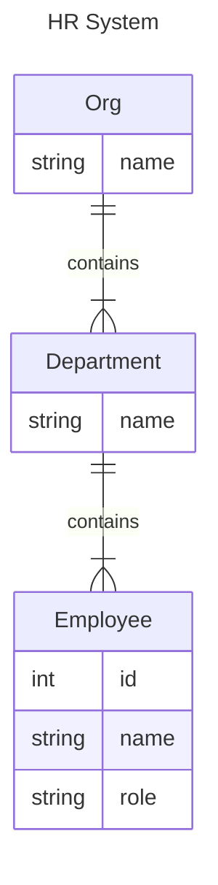

# hrsystem: oncecache example

`hrsystem` contains a `oncecache` example. It is a simple staff directory backed by an
in-memory "database". It uses `oncecache` to reduce DB calls.

The Raison d'être of `hrsystem` is to demonstrate cache entry propagation across a
composite cache.

Consider a trivial HR system:



In Go, we might model this system as:

```go
type Org struct {
	Name        string        `json:"name"`
	Departments []*Department `json:"departments"`
}

type Department struct {
	Name  string      `json:"name"`
	Staff []*Employee `json:"staff"`
}

type Employee struct {
	Name string `json:"name"`
	Role string `json:"role"`
	ID   int    `json:"id"`
}

type HRSystem interface {
	GetOrg(ctx context.Context, org string) (*Org, error)
	GetDepartment(ctx context.Context, dept string) (*Department, error)
	GetEmployee(ctx context.Context, ID int) (*Employee, error)
}
```

Now, consider when `HRSystem.GetOrg` is called: it returns the
entire constructed tree containing all `Department`s, which in turn contain
all `Employee`s. We could use a `oncecache.Cache[string, *Org]` to cache
the `Org` objects.

But, later, we might want to retrieve a single `Employee`
via `HRSystem.GetEmployee(ctx, 1234)`. Typically, the `HRSystem` impl would fetch that `Employee`
from the database, but note that the `Employee` is already present in the `Org` cache, as
a child of a `Department` object.

We can use `oncecache` to propagate cache entries across composite caches.

```go
// NewHRCache wraps db with a caching layer.
func NewHRCache(log *slog.Logger, db HRSystem) *HRCache {
	c := &HRCache{
		log:   log,
		db:    db,
	}

	c.orgs = oncecache.New[string, *Org](
		db.GetOrg,
		oncecache.OnFill(c.onFillOrg),
	)

	c.depts = oncecache.New[string, *Department](
		db.GetDepartment,
		oncecache.OnFill(c.onFillDept),
	)

	c.employees = oncecache.New[int, *Employee](
		db.GetEmployee,
	)

	return c
}
```

In the code above, the `NewHRCache` constructor adds [`OnFill`](https://pkg.go.dev/github.com/neilotoole/oncecache#OnFill) event handlers to the
`Org` and `Department` caches. Thus, a `Get` call to the Org cache will trigger
`onFillOrg`:

```go
// onFillOrg is invoked by HRCache.orgs when that cache fills an [Org] value from
// the DB. This handler propagates values from the returned [Org] to the
// HRCache.depts cache.
func (c *HRCache) onFillOrg(ctx context.Context, _ string, org *Org, err error) {
	if err != nil {
		return
	}

	for _, dept := range org.Departments {
		// Filling a dept entry should in turn propagate to the employees cache.
		_ = c.depts.MaybeSet(ctx, dept.Name, dept, nil)
	}
}
```

When `onFillOrg` is invoked, it iterates over the `Department`s in the `Org` and
calls `MaybeSet` on the `Department` cache. This in turn triggers the `onFillDept`,
which invokes `MaybeSet` on the `Employee` cache:

```go
// onFillDept is invoked by HRCache.depts when that cache fills a [Department]
// value from the DB. This handler propagates [Employee] values from the
// returned [Department] to the HRCache.employees cache.
func (c *HRCache) onFillDept(ctx context.Context, _ string, dept *Department, err error) {
	if err != nil {
		return
	}

	for _, emp := range dept.Staff {
		_ = c.employees.MaybeSet(ctx, emp.ID, emp, nil)
	}
}
```
